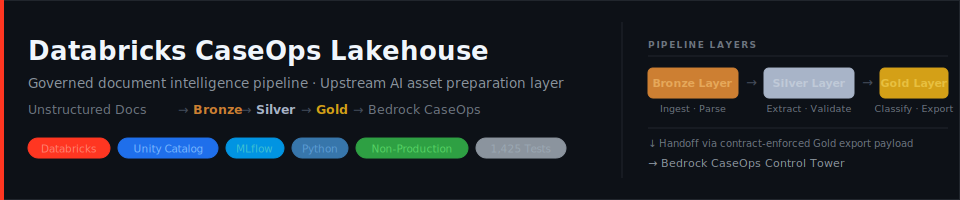

<div align="center">
  
</div>

<div align="center">

[](https://www.python.org/)
[](https://www.databricks.com/)
[](https://mlflow.org/)
[](./tests/)
[]()

</div>

<br/>

> A Databricks-native governed document intelligence pipeline — the upstream preparation layer that converts unstructured enterprise documents into traceable, schema-validated AI-ready assets before downstream Bedrock retrieval and agent reasoning begins.

---

## What This Project Does

Enterprise operations accumulate large volumes of unstructured documents — regulatory notices, incident reports, standard operating procedures, quality reviews, and technical advisories. These documents carry operationally significant information, but without structured, governed transformation, they cannot be reliably extracted from, classified, or consumed by downstream AI retrieval and agent systems.

This repo implements the **governed upstream transformation layer** on Databricks — the system that must exist before any downstream retrieval, RAG, or agent reasoning begins:

1. **Ingests** unstructured documents into governed Unity Catalog Volumes with full source provenance
2. **Parses** raw document content using `ai_parse_document` and normalizes it into a Bronze layer
3. **Extracts** structured fields from parsed content using `ai_extract` into a Silver layer
4. **Classifies and routes** documents using `ai_classify` into a Gold layer of AI-ready assets
5. **Evaluates** every stage for extraction quality, schema validity, and cross-layer traceability using MLflow
6. **Exports** contract-enforced Gold-tier assets to downstream Bedrock retrieval and agent systems

---

## Positioning

This repo is the **upstream governed preparation layer** of the Bedrock CaseOps architecture. It owns the complete ingestion-to-handoff pipeline — governed document transformation, structured extraction, schema validation, classification, routing, and AI-ready asset materialization. Retrieval, agent reasoning, escalation, and case-support belong to the [Bedrock CaseOps Control Tower](https://github.com/NavidBroumandfar/bedrock-caseops-control-tower).

| Concern | This Repo | Bedrock CaseOps |
|---|---|---|
| Raw document ingestion | Yes | No |
| Parsing and extraction | Yes | No |
| Schema validation and traceability | Yes | No |
| Classification and routing | Yes | No |
| Governed AI-ready asset preparation | Yes | No |
| Gold export payload delivery | Yes (file/Delta) | Consumes |
| Retrieval and RAG | No | Yes |
| Agent reasoning and orchestration | No | Yes |
| Escalation and case-support workflows | No | Yes |
| KPI reporting or cross-case analytics | No | Out of scope for both |

This repo is the **governed upstream structuring layer**. It does not reason over documents, orchestrate decisions, or produce operational dashboards. Its contract is: raw document in, structured AI-ready record out.

---

## Supported Document Domains

The pipeline is designed for document-heavy operational and regulatory workflows:

- FDA warning letters and safety notices
- CISA advisories and cybersecurity bulletins
- Incident reports and post-mortems
- Standard operating procedures (SOPs)
- Quality review and audit records
- Technical support and case review documents

---

## Architecture Overview

```
Unity Catalog Volumes (raw)
        │
        ▼
  Bronze Layer  ─── raw parsed text, source metadata, parse provenance
        │
        ▼
  Silver Layer  ─── structured field extraction, schema-validated records
        │
        ▼
  Gold Layer    ─── classified, routed, AI-ready assets
        │
        ▼
  Downstream    ─── Bedrock retrieval index / agent context payloads
```

All layers are governed by Unity Catalog. All transformations are traceable via MLflow. See [`ARCHITECTURE.md`](./ARCHITECTURE.md) for full design detail.

---

## Tech Stack

| Component | Technology |
|---|---|
| Platform | Databricks |
| Storage governance | Unity Catalog, Volumes |
| Parsing | `ai_parse_document` |
| Extraction | `ai_extract` |
| Classification | `ai_classify` |
| Evaluation & tracing | MLflow |
| Language (pipelines) | Python, SQL |
| Config | YAML |
| Docs | Markdown |

---

## Project Status

**V1 and V2 are both complete.**

**Phase 1 (V1 — Core Governed Pipeline)** delivered the full Bronze → Silver → Gold document intelligence pipeline: Unity Catalog-governed ingestion, `ai_parse_document`-based Bronze parsing, `ai_extract`-based Silver structured field extraction, `ai_classify`-based Gold classification and routing, MLflow evaluation across all four quality dimensions (parse quality, extraction quality, classification quality, traceability), and the complete Gold → Bedrock handoff preparation layer — including contract definition, schema enforcement, export materialization, batch bundle packaging, and integrity validation. V1 was validated end-to-end in a personal Databricks workspace using real AI Functions against public FDA sample documents.

**Phase 2 (V2 — Hardening and Expansion)** added live handoff integration via Delta Sharing with a producer-side delivery layer (Phase C), multi-domain pipeline expansion across three active document domains — FDA warning letters, CISA cybersecurity advisories, and incident reports (Phase D), and enterprise operational hardening: structured human review queue and reprocessing, multi-environment configuration separation, and governance monitoring (Phase E).

**Current state**: Portfolio-safe and non-production. No enterprise deployment, no production credentials, no live Bedrock integration beyond the producer-side delivery preparation layer. The pipeline is fully functional locally and was validated in a personal Databricks workspace. Total test coverage: **1,425 tests** across all pipeline stages, contract layers, export boundaries, delivery validation, multi-domain framework, and operational hardening.

For the full delivery history, phase-by-phase detail, and roadmap, see [`PROJECT_SPEC.md`](./PROJECT_SPEC.md) and [`docs/roadmap.md`](./docs/roadmap.md).

To run the local Gold demo, see the [Running the Gold Demo](#running-the-gold-demo) section below.

---

## Running the Bronze Demo

Requires Python 3.9+ and `pydantic` (v2). No Databricks workspace needed.

```bash
# 1. Install the only required dependency
pip install pydantic

# 2. Ingest the sample FDA warning letter → produces a Bronze JSON artifact
python src/pipelines/ingest_bronze.py \
  --input examples/fda_warning_letter_sample.md \
  --document-class-hint fda_warning_letter \
  --source-system local_dev

# Artifact is written to output/bronze/<bronze_record_id>.json

# 3. Run Bronze evaluation against all artifacts in the output directory
python src/evaluation/eval_bronze.py --input-dir output/bronze

# Optional: evaluate a single artifact
python src/evaluation/eval_bronze.py --input output/bronze/<bronze_record_id>.json
```

The evaluation script prints a parse quality summary and writes a JSON evaluation artifact to `output/eval/`.

---

## Running the Silver Demo

Requires Python 3.9+ and `pydantic` (v2). No Databricks workspace needed.
If you have already run the Bronze demo, skip step 2.

```bash
# 1. Install the only required dependency
pip install pydantic

# 2. Ingest the sample FDA warning letter → produces a Bronze JSON artifact
python src/pipelines/ingest_bronze.py \
  --input examples/fda_warning_letter_sample.md \
  --document-class-hint fda_warning_letter \
  --source-system local_dev

# Artifact is written to output/bronze/<bronze_record_id>.json

# 3. Extract structured fields from Bronze → produces a Silver JSON artifact
python src/pipelines/extract_silver.py --input-dir output/bronze

# Artifact is written to output/silver/<extraction_id>.json

# 4. Run Silver evaluation against all artifacts in the output directory
python src/evaluation/eval_silver.py --input-dir output/silver

# Optional: evaluate a single artifact
python src/evaluation/eval_silver.py --input output/silver/<extraction_id>.json
```

The evaluation script prints an extraction quality summary (validity rate, field
coverage, required-field null rate) and writes a JSON evaluation artifact to
`output/eval/`. See `examples/expected_silver_fda_warning_letter.json` for a
reference fixture showing a successful extraction result.

---

## Running the Gold Demo

Requires Python 3.9+ and `pydantic` (v2). No Databricks workspace needed.
If you have already run the Bronze and Silver demos, skip steps 2–3.

```bash
# 1. Install the only required dependency
pip install pydantic

# 2. Ingest the sample FDA warning letter → produces a Bronze JSON artifact
python src/pipelines/ingest_bronze.py \
  --input examples/fda_warning_letter_sample.md \
  --document-class-hint fda_warning_letter \
  --source-system local_dev

# Artifact is written to output/bronze/<bronze_record_id>.json

# 3. Extract structured fields from Bronze → produces a Silver JSON artifact
python src/pipelines/extract_silver.py --input-dir output/bronze

# Artifact is written to output/silver/<extraction_id>.json

# 4. Classify Silver records → produces Gold artifacts and export payloads
python src/pipelines/classify_gold.py \
  --input-dir output/silver \
  --bronze-dir output/bronze

# Gold record: output/gold/<gold_record_id>.json
# Export payload (if export-ready and contract-valid): output/gold/exports/regulatory_review/<document_id>.json
# Invalid payloads are blocked before write — see contract_validation_errors in pipeline output

# Optional: produce a handoff batch report
python src/pipelines/classify_gold.py \
  --input-dir output/silver \
  --bronze-dir output/bronze \
  --report-dir output/reports

# Report artifacts: output/reports/handoff_report_<run_id>.json  (machine-readable)
#                   output/reports/handoff_report_<run_id>.txt   (human-readable)

# Optional: produce a batch manifest and review bundle (may be combined with --report-dir)
python src/pipelines/classify_gold.py \
  --input-dir output/silver \
  --bronze-dir output/bronze \
  --report-dir output/reports \
  --bundle-dir output/reports

# Bundle artifacts: output/reports/handoff_bundle_<run_id>.json  (machine-readable manifest)
#                   output/reports/handoff_bundle_<run_id>.txt   (human-readable review summary)
# The bundle references all per-record artifact paths and the handoff report when both flags are used.

# Optional: run bundle integrity validation against the generated bundle
python -c "
from pathlib import Path
from src.pipelines.handoff_bundle_validation import validate_handoff_bundle, format_validation_result_text
import glob
bundles = sorted(glob.glob('output/reports/handoff_bundle_*.json'))
if bundles:
    result = validate_handoff_bundle(Path(bundles[-1]))
    print(format_validation_result_text(result))
"

# 5. Run Gold evaluation against all artifacts in the output directory
python src/evaluation/eval_gold.py --input-dir output/gold

# Optional: evaluate a single artifact
python src/evaluation/eval_gold.py --input output/gold/<gold_record_id>.json
```

The evaluation script prints a classification quality summary (success rate,
export-ready rate, confidence distribution, label distribution) and writes a
JSON evaluation artifact to `output/eval/`. See
`examples/expected_gold_fda_warning_letter.json` for a reference fixture showing
a successful classification and export-ready result.

---

## Running the Delivery Demo

Requires Python 3.9+ and `pydantic` (v2). Run the full Gold Demo first to generate artifacts.

```bash
# 1–3. Run the Bronze, Silver, Gold demos (if not already done)
python src/pipelines/ingest_bronze.py \
  --input examples/fda_warning_letter_sample.md \
  --document-class-hint fda_warning_letter \
  --source-system local_dev

python src/pipelines/extract_silver.py --input-dir output/bronze

# 4. Classify Gold with delivery augmentation enabled
python src/pipelines/classify_gold.py \
  --input-dir output/silver \
  --bronze-dir output/bronze \
  --report-dir output/reports \
  --bundle-dir output/reports \
  --delivery-dir output/delivery

# Delivery artifacts:
#   output/delivery/delivery_event_<run_id>.json   — DeliveryEvent record (schema v0.2.0)
#   output/delivery/delivery_event_<run_id>.txt    — Human-readable delivery event summary
#   output/delivery/delta_share_preparation_manifest.json — Share config + Unity Catalog SQL DDL
```

The delivery event JSON carries `status: "prepared"` — the producer-side layer is complete.
The Delta Share preparation manifest contains the Unity Catalog SQL DDL to provision the share
in a Databricks workspace. See [Running Delivery Validation](#running-delivery-validation) to
validate the delivery artifacts locally.

When `--delivery-dir` is active, export payloads are written at `schema_version: v0.2.0` with
three optional provenance fields: `delivery_mechanism`, `delta_share_name`, `delivery_event_id`.
When `--delivery-dir` is omitted, baseline export behavior (v0.1.0) is fully preserved.

---

## Running the Review Queue

Requires Python 3.9+ and `pydantic` (v2). Run the Gold Demo first to generate pipeline artifacts.

```bash
# Run the Gold pipeline with full report, bundle, and review queue output
python src/pipelines/classify_gold.py \
  --input-dir output/silver \
  --bronze-dir output/bronze \
  --report-dir output/reports \
  --bundle-dir output/reports \
  --review-queue-dir output/review_queue

# Review queue artifacts:
#   output/review_queue/review_queue_<run_id>.json  — ReviewQueueArtifact (machine-readable)
#   output/review_queue/review_queue_<run_id>.txt   — Human-readable review queue summary
```

The review queue collects records with:
- `outcome_category == 'quarantined'` → reason: `quarantined`
- `outcome_category == 'contract_blocked'` → reason: `contract_blocked`
- `outcome_category == 'skipped_not_export_ready'` AND `document_type_label == 'unknown'` → reason: `extraction_failed`

To record a review decision and produce a reprocessing request:

```python
from src.schemas.review_decision import (
    ReviewDecision,
    DECISION_REQUEST_REPROCESSING,
    REVIEW_DECISION_SCHEMA_VERSION,
    build_reprocessing_request,
    make_decision_id,
    validate_review_decision,
    validate_reprocessing_request,
)
from datetime import datetime, timezone

# Load a queue entry (from the review queue JSON)
# ... queue_entry = loaded_queue["queue_entries"][0] ...

decision = ReviewDecision(
    decision_id=make_decision_id(),
    queue_entry_id=queue_entry["queue_entry_id"],
    document_id=queue_entry["document_id"],
    gold_record_id=queue_entry["gold_record_id"],
    pipeline_run_id=queue_entry["pipeline_run_id"],
    decided_at=datetime.now(tz=timezone.utc).isoformat(),
    schema_version=REVIEW_DECISION_SCHEMA_VERSION,
    decision=DECISION_REQUEST_REPROCESSING,
    decision_rationale="Reviewer identified this as an FDA warning letter. Re-extract with explicit class hint.",
    reprocessing_request_id="placeholder-to-be-replaced",
)

reprocessing_req = build_reprocessing_request(
    decision=decision,
    reprocessing_reason="Document classified as unknown but contains FDA warning letter structure.",
    suggested_document_class_hint="fda_warning_letter",
)

# Update decision with the real reprocessing_request_id
decision.reprocessing_request_id = reprocessing_req.reprocessing_request_id

errors = validate_review_decision(decision)
assert not errors, errors
errors = validate_reprocessing_request(reprocessing_req)
assert not errors, errors
```

See `examples/expected_review_queue.json`, `examples/expected_review_decision.json`, and `examples/expected_reprocessing_request.json` for reference artifacts.

---

## Running Delivery Validation

Requires Python 3.9+ and `pydantic` (v2). Run the Delivery Demo first to generate delivery artifacts.

```bash
# Run delivery validation against the generated delivery artifacts
python -c "
from pathlib import Path
import glob
from src.pipelines.delivery_validation import (
    validate_delivery_layer,
    format_validation_result_text,
    write_validation_result,
)

# Locate delivery event (adjust run_id to match your run)
events = sorted(glob.glob('output/delivery/delivery_event_*.json'))
if not events:
    print('No delivery event found. Run the Delivery Demo first.')
else:
    # Extract run_id from filename
    import re
    run_id = re.sub(r'^delivery_event_|\.json$', '', Path(events[-1]).name)
    result = validate_delivery_layer(
        pipeline_run_id=run_id,
        delivery_event_path=Path(events[-1]),
        share_manifest_path=Path('output/delivery/delta_share_preparation_manifest.json'),
        workspace_mode='local_repo_only',
    )
    print(format_validation_result_text(result))
    json_path, text_path = write_validation_result(result, Path('output/validation'))
    print(f'Written: {json_path}')
"

# Expected: status = 'not_provisioned' — correct and honest.
# This means: delivery artifacts are correct producer-side; Delta Share not yet
# executed in Unity Catalog. Run setup_sql from the manifest in Databricks SQL
# to proceed toward 'validated' status (see docs/delivery-runtime-validation.md).
```

Integration health states:
- `not_provisioned` — Share designed in repo, not yet executed in Unity Catalog (honest default)
- `partially_validated` — Producer-side correct; share provisioned; no live queries run
- `validated` — Confirmed in personal Databricks workspace
- `failed` — Schema error, ID mismatch, or parse failure

See [`docs/delivery-runtime-validation.md`](./docs/delivery-runtime-validation.md) for the full delivery validation design, check catalogue, and personal Databricks runtime validation runbook.

---

## Running the Evaluation Layer

Requires Python 3.9+ and `pydantic` (v2). Run the pipeline demos first to generate artifacts.

```bash
# Run the full evaluation pass across all three layers
python src/evaluation/run_evaluation.py \
  --bronze-dir output/bronze \
  --silver-dir output/silver \
  --gold-dir output/gold

# Reports are written to output/eval/:
#   report_<id>.json  — machine-readable full report
#   report_<id>.txt   — human-readable summary
```

Or run individual evaluators:

```bash
# Bronze: parse quality
python src/evaluation/eval_bronze.py --input-dir output/bronze

# Silver: extraction quality
python src/evaluation/eval_silver.py --input-dir output/silver

# Gold: classification quality (null-confidence safe)
python src/evaluation/eval_gold.py --input-dir output/gold

# Cross-layer traceability
python src/evaluation/eval_traceability.py \
  --bronze-dir output/bronze \
  --silver-dir output/silver \
  --gold-dir output/gold
```

Optional MLflow logging (requires `mlflow` installed):

```bash
python src/evaluation/run_evaluation.py \
  --bronze-dir output/bronze \
  --silver-dir output/silver \
  --gold-dir output/gold \
  --mlflow
```

See [`examples/evaluation/README.md`](./examples/evaluation/README.md) for the full evaluation usage guide, including bootstrap-path context notes on null confidence and placeholder run IDs.

---

## Repository Structure

```
databricks-caseops-lakehouse/
├── README.md
├── PROJECT_SPEC.md          # Scope and roadmap source of truth
├── ARCHITECTURE.md          # Technical design source of truth
├── config/
│   ├── databricks.resources.example.yml          # Unity Catalog layout reference (no credentials)
│   ├── databricks.resources.dev.example.yml      # Dev environment layout (no credentials)
│   ├── databricks.resources.staging.example.yml  # Staging environment layout (no credentials)
│   └── databricks.resources.prod.example.yml     # Prod environment layout reference (no credentials)
├── docs/
│   ├── roadmap.md
│   ├── data-contracts.md
│   ├── evaluation-plan.md
│   ├── databricks-bootstrap.md   # Personal Databricks bootstrap validation record
│   └── prompts/             # Excluded from version control
├── src/
│   ├── schemas/             # Pydantic / JSON Schema definitions
│   │   ├── bedrock_contract.py       # Gold export payload contract validator
│   │   ├── delivery_event.py         # Delivery event schema (v0.2.0)
│   │   ├── review_queue.py           # Human review queue schema
│   │   ├── review_decision.py        # Review decision and reprocessing request schemas
│   │   └── governance_monitoring.py  # Governance monitoring schema and flag vocabulary
│   ├── pipelines/           # Bronze → Silver → Gold pipeline logic
│   │   ├── export_handoff.py             # Export packaging and handoff service boundary
│   │   ├── handoff_report.py             # Export outcome observability and batch reporting
│   │   ├── handoff_bundle.py             # Batch manifest and review bundle packaging
│   │   ├── handoff_bundle_validation.py  # Bundle integrity and consistency validation
│   │   ├── delivery_events.py            # Delivery event materialization
│   │   ├── delta_share_handoff.py        # Delta Sharing producer-side preparation layer
│   │   ├── review_queue.py               # Human review queue derivation and materialization
│   │   └── governance_monitoring.py      # Governance monitoring aggregation and reporting
│   ├── evaluation/          # Evaluation runners and report infrastructure
│   │   ├── eval_bronze.py
│   │   ├── eval_silver.py
│   │   ├── eval_gold.py          # Null-confidence safe
│   │   ├── eval_traceability.py  # Cross-layer traceability
│   │   ├── run_evaluation.py     # Full-pipeline evaluation orchestrator
│   │   ├── report_models.py      # Structured report dataclasses
│   │   ├── report_writer.py      # JSON + text report writer
│   │   └── mlflow_experiment_paths.py  # Environment-aware MLflow path resolution
│   └── utils/               # Shared helpers
│       └── environment_config.py         # Environment model and resource naming
├── notebooks/
│   └── bootstrap/           # Validated Databricks bootstrap SQL
├── tests/                   # 1,425 tests across all pipeline stages and contract layers
└── examples/
    ├── evaluation/                       # Evaluation usage guide
    ├── expected_delivery_event.json      # Reference delivery event fixture
    └── ...                              # Sample documents and expected output fixtures
```

---

## Non-Goals

This repo does **not** include:

- A frontend or UI of any kind
- A standalone chatbot or conversational interface
- Generic Databricks demo notebooks
- Scala code
- Anything that requires production credentials to demonstrate
- Cross-case analytics, trend reporting, or KPI dashboards
- Historical operational intelligence or aggregate performance metrics
- Downstream agent orchestration, reasoning, or decision runtime (that is Bedrock CaseOps)

This repo is not yet, and does not aim to be, a mature analytics backbone or operational intelligence platform. It is the governed upstream document intelligence and AI-ready asset preparation layer.

---

## Connected Repositories

This repo is the **upstream governed preparation layer** in a two-repository architecture. The boundary between them is intentional and non-negotiable.

| Repository | Role |
|---|---|
| **[databricks-caseops-lakehouse](https://github.com/NavidBroumandfar/databricks-caseops-lakehouse)** *(this repo)* | Upstream: governed document ingestion, parsing, extraction, classification, and AI-ready asset preparation on Databricks |
| **[bedrock-caseops-control-tower](https://github.com/NavidBroumandfar/bedrock-caseops-control-tower)** | Downstream: retrieval, agent reasoning, validation, and escalation workflows on AWS / Amazon Bedrock |

The handoff point between these systems is the formal **Gold export payload** — a schema-versioned, contract-enforced structured record produced by this repo and consumed by the Bedrock repo. The interface contract is defined in [`docs/bedrock-handoff-contract.md`](./docs/bedrock-handoff-contract.md).

This repo does not own retrieval, generation, agent orchestration, or escalation logic. Those concerns belong entirely to the Bedrock CaseOps Control Tower.

---

## Let's Connect

If you're exploring this project, interested in governed AI data pipelines, or open to discussing data platform and AI engineering roles — feel free to reach out.

<div align="center">

[](https://www.linkedin.com/in/navid-broomandfar/)
[](https://github.com/NavidBroumandfar)
[](mailto:broomandnavid@gmail.com)

</div>

---

*This project was developed with AI-assisted workflows. The system architecture, agent design, schema contracts, evaluation framework, and safety boundaries were intentionally designed and directed by the author, with AI tooling used to support and accelerate implementation as part of a modern engineering workflow.*
